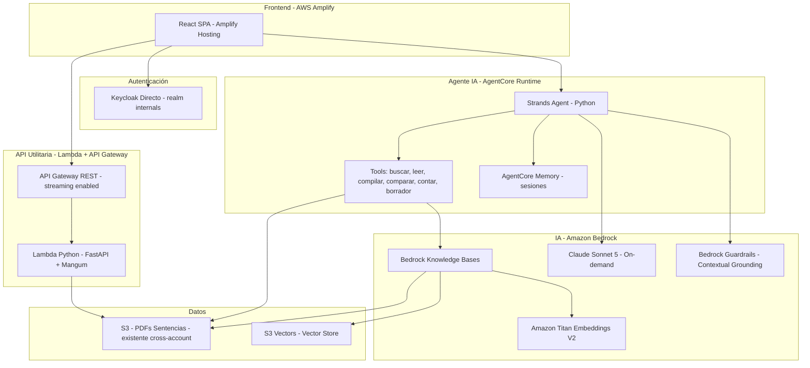
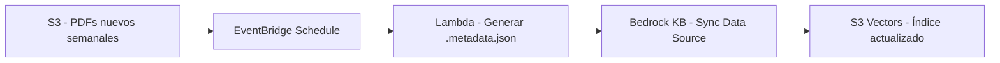
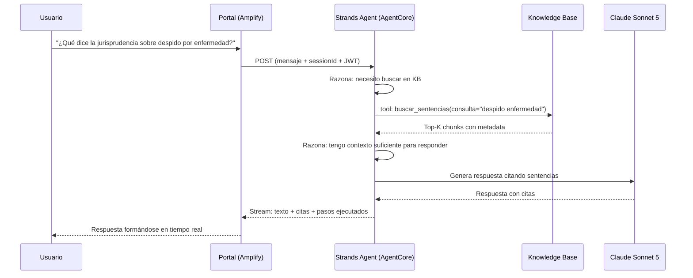
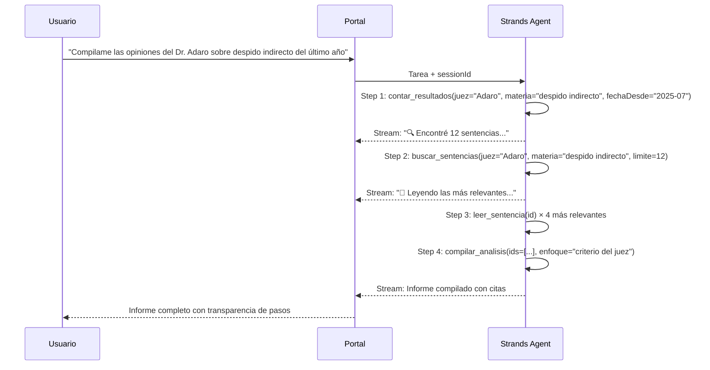

# Design Document: Jurisprudencia Inteligente Mendoza - AWS

## Overview

Sistema de búsqueda semántica y asistente experto en jurisprudencia para el Poder Judicial de Mendoza. Desarrollado sobre Strands Agents SDK + AgentCore Runtime + Bedrock Knowledge Bases.

**Funcionalidades core**:
1. Chat experto en jurisprudencia mendocina (responde preguntas citando sentencias reales)
2. Buscador semántico de sentencias (resultados como listado + respuesta en lenguaje natural)
3. Generador de borradores de resoluciones
4. Tareas agénticas multi-paso (compilar criterios, comparar sentencias, rastrear evolución)

**Contexto técnico**:
- ~27,000 sentencias en PDF (texto embebido) ya en S3, actualizadas semanalmente
- Metadatos existentes en base de datos del data lake (a solicitar acceso)
- 20-30 usuarios internos, autenticados vía Keycloak del Poder Judicial
- Todos los usuarios ven todo (sin restricción por fuero)
- Frontend desplegado en AWS Amplify
- Prioridad: precisión en las respuestas citando sentencias reales

**Estrategia de fases**:
- **Fase 1 (3-4 semanas)**: Agente con Strands SDK + KB + tools básicos → Demo funcional
- **Fase 2 (2-3 semanas)**: UX avanzada, borradores, comparaciones, progreso paso a paso
- **Fase 3 (6-8 semanas)**: Fine Tuning para conocimiento conceptual + redacción judicial

## Architecture

### Arquitectura General



### Pipeline de Ingesta Semanal



### Flujo: Chat Experto (Caso Principal)



### Flujo: Tarea Agéntica Multi-paso



## Components and Interfaces

### Componente 1: Frontend (AWS Amplify + React)

**Propósito**: Portal web con chat, buscador y generador de borradores.

**Tecnología**: React 18+ (Vite) desplegado como SPA en AWS Amplify Hosting

**Interface**:
```typescript
interface ChatMessage {
  id: string
  role: 'user' | 'assistant'
  content: string
  sources?: SentenciaReference[]
  pasosEjecutados?: string[]        // Transparencia del agente
  timestamp: Date
}

interface SentenciaReference {
  sentenciaId: string
  caratula: string
  fecha: string
  tribunal: string
  fragmentoRelevante: string
  s3Url: string                     // Link al PDF original
}

interface BusquedaRequest {
  query: string
  filtros?: {
    fuero?: string
    tribunal?: string
    fechaDesde?: string
    fechaHasta?: string
    materia?: string
    juez?: string
  }
  limit?: number
}

interface BusquedaResponse {
  resumenNatural: string
  resultados: SentenciaResultado[]
  totalEncontrados: number
}

interface BorradorRequest {
  descripcionCaso: string
  tipoResolucion: 'sentencia' | 'auto' | 'decreto' | 'resolucion'
  instrucciones?: string
}

interface BorradorResponse {
  borrador: string
  sentenciasCitadas: SentenciaReference[]
  disclaimer: string
}
```

**Responsabilidades**:
- Interfaz de chat con streaming token a token
- Componente ProgresoAgente (muestra pasos del agente en tiempo real)
- Buscador con filtros y resultados duales (natural + listado)
- Editor de borradores con citas interactivas
- Visor de PDF integrado
- Autenticación directa con Keycloak (`keycloak-js`)

### Componente 2: Autenticación (Keycloak directo, sin Cognito)

**Propósito**: Autenticar los 20-30 usuarios usando la infraestructura existente de Keycloak.

**Tecnología**: Keycloak directo con `keycloak-js` en frontend + Lambda Authorizer custom + validación JWT en AgentCore

**Configuración**:
```typescript
interface AuthConfig {
  keycloak: {
    url: 'https://auth24.pjm.gob.ar/auth/'
    realm: 'internals'
    clientId: 'jurisprudencia-ia'   // Client público, PKCE
  }
  // Sin Cognito — JWT de Keycloak validado directo
  // Lambda Authorizer para API Gateway
  // Middleware Python para AgentCore Runtime
  autorizacion: 'acceso_total_autenticado'  // Todos ven todo
}
```

**Responsabilidades**:
- Autenticar usuarios con Keycloak existente del PJM
- Lambda Authorizer custom valida JWT contra JWKS de Keycloak (cache 300s)
- Middleware Python en AgentCore valida JWT para requests al agente
- No se requieren permisos granulares (todos ven todo)

### Componente 3: Agente IA (Strands SDK + AgentCore Runtime)

**Propósito**: Agente experto en jurisprudencia que razona, busca, analiza y compila información de múltiples sentencias.

**Tecnología**: Strands Agents SDK desplegado en AgentCore Runtime

**Interface (Tools del Agente)**:
```python
@tool
def buscar_sentencias(consulta: str, fuero: str = None, tribunal: str = None,
                      juez: str = None, fecha_desde: str = None,
                      fecha_hasta: str = None, materia: str = None,
                      limite: int = 20) -> dict:
    """Busca sentencias con búsqueda semántica y filtros de metadata."""

@tool
def leer_sentencia(sentencia_id: str) -> dict:
    """Lee el texto completo de una sentencia para análisis detallado."""

@tool
def compilar_analisis(sentencia_ids: list, enfoque: str,
                      formato: str = "detallado") -> dict:
    """Sintetiza múltiples sentencias identificando patrones y evolución."""

@tool
def comparar_sentencias(sentencia_ids: list,
                        aspectos: list = None) -> dict:
    """Compara sentencias identificando coincidencias y diferencias."""

@tool
def contar_resultados(fuero: str = None, juez: str = None,
                      materia: str = None, fecha_desde: str = None,
                      fecha_hasta: str = None) -> dict:
    """Cuenta sentencias que cumplen filtros sin traer contenido."""

@tool
def generar_borrador(descripcion_caso: str, tipo_resolucion: str,
                     precedentes: list = None,
                     instrucciones: str = None) -> dict:
    """Genera borrador de resolución judicial basado en precedentes."""
```

**Responsabilidades**:
- Razonar sobre consultas y descomponerlas en pasos
- Invocar tools según necesidad (pattern ReAct)
- Mantener contexto conversacional via AgentCore Memory
- Streaming de respuestas y progreso al frontend
- Citar sentencias reales (nunca inventar)
- Pedir clarificación si la tarea es ambigua

### Componente 4: API Utilitaria (Lambda + API Gateway)

**Propósito**: Endpoints stateless que no requieren el agente (PDFs, health, metadata).

**Tecnología**: FastAPI + Mangum en Lambda, API Gateway REST API

**Interface**:
```typescript
interface APIUtilitaria {
  GET /sentencia/{id}: () => SentenciaDetalle
  GET /sentencia/{id}/pdf: () => PresignedUrl
  GET /health: () => { status: 'ok' }
}
```

**Responsabilidades**:
- Generar presigned URLs para acceso a PDFs (cross-account)
- Servir metadata de sentencias
- Health check para monitoreo

### Componente 5: Motor RAG (Bedrock Knowledge Bases + S3 Vectors)

**Propósito**: Indexar sentencias y permitir búsqueda semántica con filtrado por metadata.

**Tecnología**: Bedrock KB + Titan Embeddings V2 + S3 Vectors + Guardrails

**Configuración**:
```typescript
interface KBConfig {
  dataSource: {
    type: 'S3'
    bucketArn: string              // Bucket existente cross-account
    metadataConfiguration: { type: 'METADATA_FILE' }
  }
  embeddingModel: 'amazon.titan-embed-text-v2:0'  // 1024 dims, español nativo
  vectorStore: { type: 'S3_VECTORS' }
  chunkingStrategy: {
    type: 'HIERARCHICAL'
    parentChunkSize: 1500
    childChunkSize: 300
    overlapTokens: 60
  }
}

interface GuardrailConfig {
  contextualGroundingCheck: {
    groundingThreshold: 0.7
    relevanceThreshold: 0.5
    action: 'BLOCK'
  }
  topicPolicy: {
    blockedTopics: ['política_partidaria', 'opiniones_personales', 'temas_no_jurídicos']
  }
}
```

**Responsabilidades**:
- Parsear PDFs, chunking jerárquico, embeddings e indexación (automático)
- Búsqueda semántica con filtrado pre-vectorial por metadata
- Sync incremental semanal (solo nuevos/modificados)

### Componente 6: Pipeline de Ingesta Semanal

**Propósito**: Mantener la KB actualizada con nuevas sentencias.

**Tecnología**: EventBridge + Lambda + Bedrock KB Sync

**Responsabilidades**:
- Detectar PDFs nuevos en S3 cada semana
- Generar archivos `.metadata.json` con datos del data lake
- Disparar sincronización de KB
- Reportar fallos sin afectar otros PDFs

## Data Models

### Modelo 1: Sesión de Chat (AgentCore Memory - Managed)

AgentCore Memory gestiona sesiones de forma nativa. No se requiere DynamoDB.

```typescript
interface ChatSession {
  sessionId: string              // Generado por AgentCore
  userId: string                 // sub de Keycloak
  // Historial y estado gestionado por AgentCore Memory
}
```

### Modelo 2: Metadata de Sentencias (archivos .metadata.json en S3)

```typescript
// Archivo: sentencias/2024/expediente-123.pdf.metadata.json
interface MetadataFile {
  metadataAttributes: {
    fuero: { value: string, type: 'STRING' }
    tribunal: { value: string, type: 'STRING' }
    materia: { value: string, type: 'STRING' }
    fechaSentencia: { value: string, type: 'STRING' }  // ISO date
    caratula: { value: string, type: 'STRING' }
    expediente: { value: string, type: 'STRING' }
    jueces: { value: string, type: 'STRING' }          // comma-separated
  }
}
```

## Correctness Properties

### Property 1: Completitud de citas en respuestas
*Para toda* respuesta del Chat Experto donde se encontró jurisprudencia relevante, la respuesta SHALL incluir al menos una referencia con carátula, tribunal, fecha, fragmento relevante y enlace al PDF original.
**Validates: Requirements 1.2, 1.4**

### Property 2: Validez de identificadores de citas
*Para toda* sentencia citada, el identificador SHALL corresponder a un documento real existente e indexado en la Knowledge Base.
**Validates: Requirements 6.3**

### Property 3: Completitud de resultados de búsqueda
*Para toda* consulta al Buscador que retorna resultados, la respuesta SHALL contener un resumen en lenguaje natural y un listado con carátula, tribunal, fecha, fuero y fragmento relevante.
**Validates: Requirements 2.1, 2.2**

### Property 4: Correctitud de filtros
*Para cualquier* combinación de filtros aplicados, todos los resultados retornados SHALL cumplir todos los filtros seleccionados.
**Validates: Requirements 2.3**

### Property 5: Completitud del generador de borradores
*Para todo* borrador generado, SHALL incluir sentencias citadas, disclaimer, y tipo de resolución válido.
**Validates: Requirements 3.2, 3.3, 3.4**

### Property 6: Aislamiento de sesiones
*Para cualquier* par de sesiones, el historial de una SHALL no influir en las respuestas de la otra.
**Validates: Requirements 7.5**

### Property 7: Completitud de indexación
*Para todo* PDF procesado exitosamente, SHALL estar indexado como embeddings en la KB.
**Validates: Requirements 5.3**

### Property 8: Enforcement de autenticación
*Para todo* request sin JWT válido, el Sistema SHALL rechazar con error de autenticación.
**Validates: Requirements 4.3**

### Property 9: Completitud de auditoría
*Para toda* consulta procesada, SHALL existir un registro con userId, timestamp y tipo de operación.
**Validates: Requirements 9.3**

## Error Handling

### Error 1: No se encuentra jurisprudencia relevante
**Condición**: Búsqueda retorna chunks con score < 0.3.
**Respuesta**: "No encontré jurisprudencia específica. Sugiero reformular la consulta."
**Recuperación**: Log para análisis de gaps.

### Error 2: Timeout en Bedrock/AgentCore
**Condición**: Respuesta no llega en 30 segundos.
**Respuesta**: "La consulta está tomando más tiempo. Intentá de nuevo."
**Recuperación**: Retry con backoff. Alarma si tasa > 5%.

### Error 3: PDF no parseable
**Condición**: KB no puede procesar un PDF.
**Respuesta**: Se marca como fallido. No afecta otros.
**Recuperación**: Notificación al admin.

### Error 4: Keycloak no disponible
**Condición**: IdP no responde.
**Respuesta**: Página de error indicando problema de autenticación.
**Recuperación**: Frontend usa refresh tokens; si falla, redirige a login.

## Performance Considerations

### Latencia objetivo

| Funcionalidad | Latencia P95 |
|---|---|
| Chat primera respuesta (streaming) | < 3s |
| Búsqueda semántica | < 4s |
| Generación de borrador | < 15s |
| Tarea agéntica multi-paso | < 60s (con streaming de progreso) |

### Costos estimados mensuales (20-30 usuarios)

| Servicio | Estimación |
|---|---|
| Bedrock Claude Sonnet 5 (inferencia) | $80-150/mes |
| Bedrock Titan Embeddings V2 | $5-10/mes |
| S3 Vectors (storage + queries) | $5-15/mes |
| AgentCore Runtime | $20-50/mes |
| Lambda (utilitarios) | $5/mes |
| API Gateway | $3/mes |
| Amplify Hosting | $5/mes |
| Bedrock Guardrails | ~$5/mes |
| **Total estimado** | **$130-245/mes** |

### S3 Vectors como vector store
- PDFs ya en S3 → vectores en mismo ecosistema
- Integración nativa con Bedrock KB
- ~90% más barato que OpenSearch Serverless para este volumen
- Sin OCUs mínimos, sin infra que provisionar
- Latencia ~100ms para queries — suficiente para el caso de uso

## Security Considerations

### Modelo de acceso simplificado
- **Autenticación**: Keycloak directo (`keycloak-js` + Lambda Authorizer + middleware Python)
- **Autorización**: Binaria — autenticado = acceso total
- **Cifrado**: TLS 1.3 en tránsito, SSE-S3/KMS en reposo
- **Auditoría**: CloudWatch Logs con userId en cada consulta
- **Guardrails de Bedrock**: Respuestas restringidas al ámbito jurídico
- **Sin Cognito**: Se eliminó el intermediario innecesario

## Dependencies

### Servicios AWS

| Servicio | Propósito |
|---|---|
| Amazon Bedrock (Knowledge Bases) | RAG automático sobre PDFs |
| Amazon Bedrock (Claude Sonnet 5) | LLM - on demand |
| Amazon Bedrock (Titan Embeddings V2) | Embeddings en español |
| Amazon S3 Vectors | Vector store nativo |
| Amazon Bedrock AgentCore Runtime | Deploy managed del agente Strands |
| Amazon Bedrock AgentCore Memory | Sesiones persistentes |
| Amazon Bedrock Guardrails | Anti-alucinación |
| AWS Lambda (Python 3.12) | API utilitaria |
| Amazon API Gateway (REST) | Endpoints + streaming |
| AWS Amplify Hosting | Frontend SPA |
| Amazon S3 (existente) | PDFs de sentencias |
| Amazon EventBridge | Trigger ingesta semanal |
| Amazon CloudWatch | Logs, métricas, alarmas |

### Librerías Python principales

| Librería | Propósito |
|---|---|
| `strands-agents` | SDK del agente |
| `strands-agents-tools` | Tools vended (KB, etc.) |
| `boto3` | AWS SDK |
| `fastapi` + `mangum` | API utilitaria en Lambda |
| `python-jose[cryptography]` | Validación JWT Keycloak |
| `httpx` | HTTP async (JWKS) |
| `pydantic` v2 | Schemas y validación |

### Frontend

| Librería | Propósito |
|---|---|
| React 18+ (Vite) | Framework UI |
| TailwindCSS | Estilos |
| react-router-dom v6 | Routing |
| keycloak-js | Auth directa |
| react-pdf / iframe | Visor PDF |
| react-markdown | Render respuestas |

## Decisiones de Diseño

### Strands Agents SDK + AgentCore Runtime (reemplaza Bedrock Agents Classic)
- Bedrock Agents Classic deja de aceptar nuevos clientes el 30 julio 2026
- Strands es open source, testeable localmente, con tools como funciones Python
- AgentCore Runtime provee deploy managed con scaling, sessions, streaming
- Mismo poder agéntico, más control y mejor developer experience
- El agente ya incluye las capacidades de "Fase 2 agéntica" desde el inicio

### Keycloak directo (sin Cognito)
- Los usuarios ya existen en Keycloak del PJM
- Notifica y otros sistemas usan la misma estrategia
- Un servicio menos = menos complejidad y costo
- Lambda Authorizer custom cachea validación (300s TTL)
- Se pierde JWT authorizer nativo de API Gateway — impacto mínimo

### API Gateway REST con Response Streaming
- Soporta streaming desde Lambda proxy (transferMode: STREAM)
- Timeout extendido hasta 15 minutos (no el límite de 29s)
- El frontend lee chunks con fetch + ReadableStream
- No se necesitan WebSockets ni Function URLs

### Arquitectura híbrida (AgentCore + Lambda)
- El agente corre en AgentCore Runtime (chat, tareas complejas, borradores)
- Endpoints utilitarios en Lambda (presigned URLs, health) — más simples y baratos
- Cada componente usa el runtime apropiado a su naturaleza

### Sin Neptune/Grafos en Fases 1-2
- Grafos son "nice to have" — no core
- Se pueden agregar después si hay demanda real
- La comparación y relaciones se resuelven con tools del agente

### Sin Fine Tuning en Fases 1-2
- Claude Sonnet 5 con RAG da precisión excelente sin FT
- FT agrega valor en redacción con "estilo judicial" y conocimiento conceptual
- Se difiere a Fase 3 (6-8 semanas adicionales de trabajo)
- Para la demo, RAG puro es suficiente

### IaC con SAM (no CDK)
- Proyecto pequeño (2-3 Lambdas + API Gateway)
- SAM es más simple, YAML declarativo
- `sam local invoke` para testing local
- CDK sería overkill para este volumen

### Metadata Filtering con .metadata.json
- Cada PDF tiene archivo .metadata.json con campos del data lake
- Bedrock KB los ingesta automáticamente
- Permite filtrado PRE-vectorial (fuero, tribunal, fecha, juez, materia)
- Los campos se obtienen de la base del data lake existente

## Fases de Desarrollo

### Fase 1: MVP con Agente Strands (Semanas 1-4)

**Semana 1**:
- Configurar Bedrock KB apuntando al S3 existente
- Configurar S3 Vectors como vector store
- Ejecutar sync inicial, testear retrieval
- Configurar Keycloak client `jurisprudencia-ia`

**Semana 2**:
- Implementar agente Strands con tools básicos (buscar, leer, contar)
- Testing local del agente (sin deploy)
- Crear Lambda Authorizer custom
- Scaffold del frontend en Amplify

**Semana 3**:
- Deployar agente en AgentCore Runtime
- Implementar streaming frontend ↔ agente
- Implementar chat con progreso del agente visible
- Implementar buscador semántico con filtros

**Semana 4**:
- Agregar tools: compilar_analisis, comparar_sentencias
- Implementar generador de borradores (como tool)
- Testing con usuarios reales (2-3 jueces)
- Pulir UX → Demo a gerencia

### Fase 2: UX Avanzada (Semanas 5-7)

- Visor de PDF integrado
- Historial de sesiones
- Exportar/copiar borradores
- Refinamiento de prompts según feedback
- Pipeline de ingesta semanal
- Monitoreo y alarmas CloudWatch

### Fase 3: Fine Tuning (Semanas 8-15)

- Preparar dataset de entrenamiento
- Entrenar modelo en SageMaker
- Evaluar y ajustar
- Deploy como Custom Model en Bedrock
- El agente usa FT para redacción + RAG para datos frescos

## Testing Strategy

### Unit Testing (Agente)
- Testear cada tool individualmente con mocks de Bedrock KB
- Verificar formato de respuestas, manejo de errores, filtrado correcto
- Testear system prompt: el agente cita fuentes, no alucina, pide clarificación

### Integration Testing
- Agente contra KB real: pregunta → respuesta con citas verificables
- Validar que citas corresponden a sentencias reales en S3
- Test de búsqueda con filtros: verificar que resultados respetan todos los filtros
- Test de borradores: verificar disclaimer, tipo válido, citas reales

### Acceptance Testing (con usuarios)
- 3-5 jueces/letrados prueban con preguntas reales de su práctica
- Validan precisión de citas y relevancia de respuestas
- Prueban generador con casos reales
- Prueban tareas multi-paso (compilar criterios, comparar sentencias)

### Local Testing (ventaja de Strands)
- El agente se puede correr 100% local con `python -m agente.agente_jurisprudencia`
- Solo requiere credenciales AWS para invocar Bedrock y KB
- No necesita deploy para iterar sobre prompts y tools
