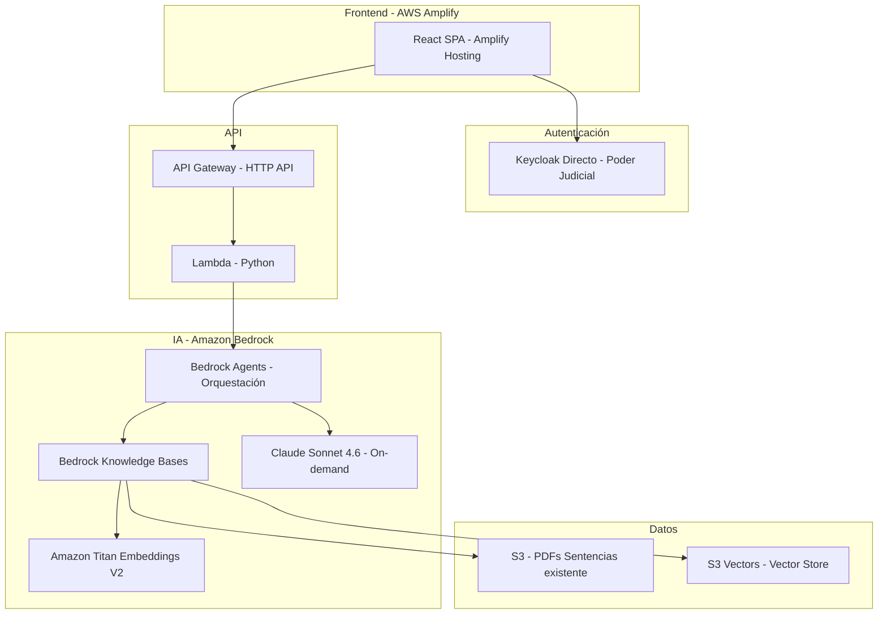
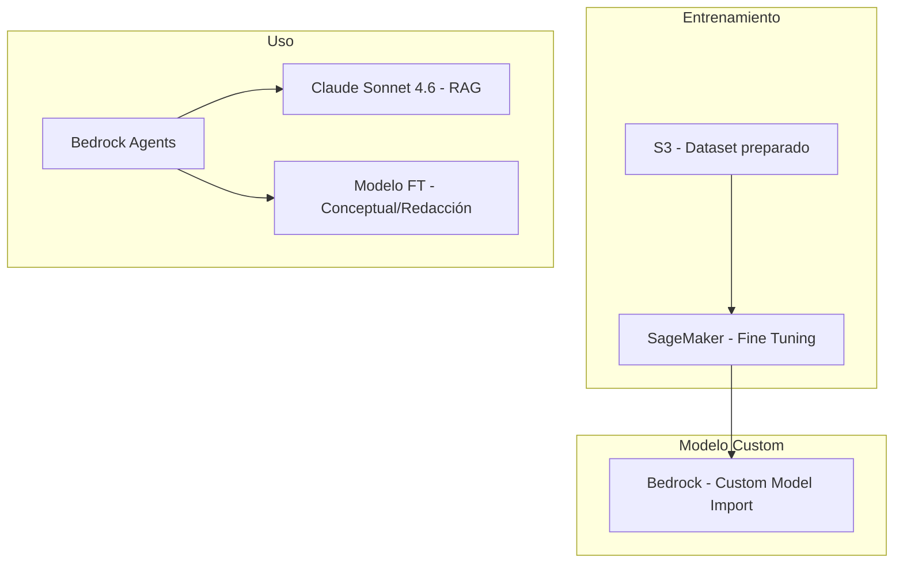
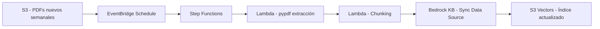
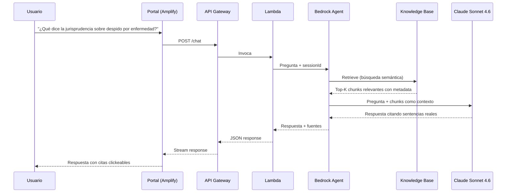
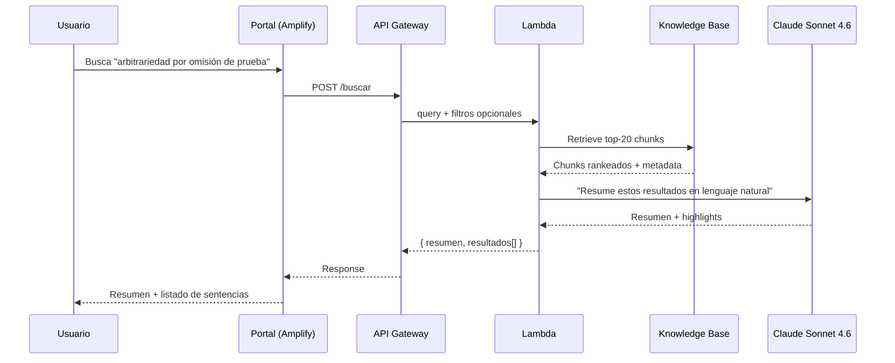
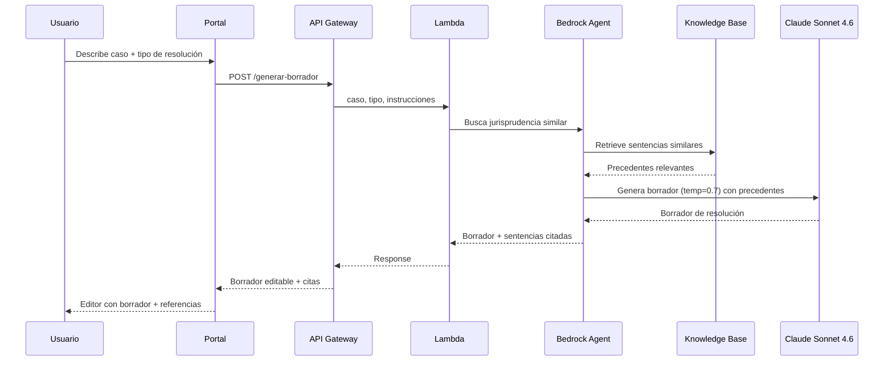
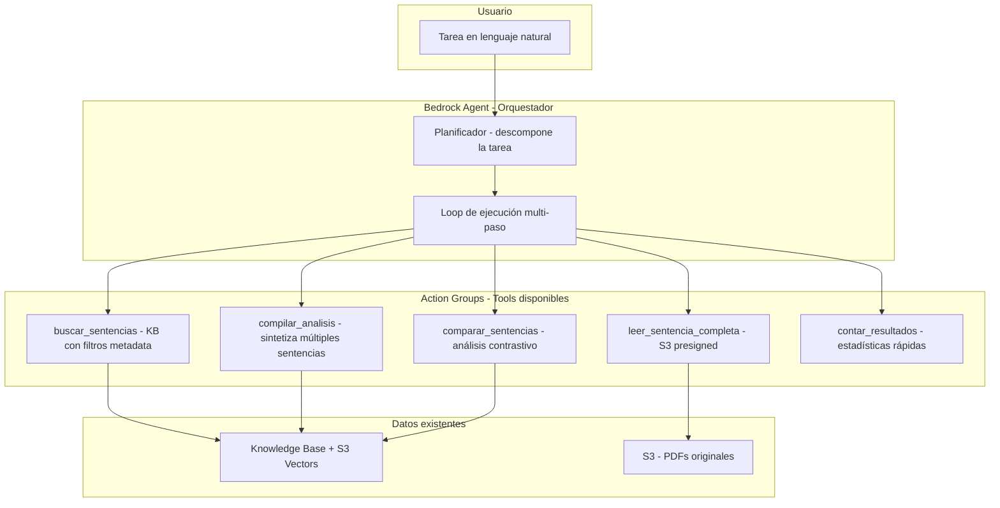

# Design Document: Jurisprudencia Inteligente Mendoza - AWS

## Overview

Sistema de búsqueda semántica y asistente experto en jurisprudencia para el Poder Judicial de Mendoza. Desarrollado en dos fases sobre servicios gestionados de AWS para máxima velocidad de entrega.

**Funcionalidades core (prioridad)**:
1. Chat experto en jurisprudencia mendocina (responde preguntas citando sentencias reales)
2. Buscador semántico de sentencias (resultados como listado + respuesta en lenguaje natural)
3. Generador de borradores de resoluciones

**Contexto técnico**:
- ~27,000 sentencias en PDF (texto embebido) ya en S3, actualizadas semanalmente
- Metadatos existentes en base de datos del data lake (a solicitar acceso)
- 20-30 usuarios internos, autenticados vía Keycloak del Poder Judicial
- Todos los usuarios ven todo (sin restricción por fuero)
- Frontend desplegado en AWS Amplify
- Prioridad: precisión en las respuestas citando sentencias reales

**Estrategia de dos fases**:
- **Fase 1 (2-3 semanas)**: RAG puro con Claude Sonnet 4.6 + Bedrock Knowledge Bases + AgentCore → Demo funcional
- **Fase 2 (6-8 semanas adicionales)**: Fine Tuning para conocimiento conceptual profundo + redacción de borradores

## Architecture

### Fase 1: RAG con Bedrock Knowledge Bases



### Fase 2: Fine Tuning (adicional)



### Pipeline de Ingesta Semanal



### Flujo: Chat Experto (Caso Principal)



### Flujo: Buscador Semántico



### Flujo: Generador de Borradores



## Components and Interfaces

### Componente 1: Frontend (AWS Amplify + React)

**Propósito**: Portal web con chat, buscador y generador de borradores.

**Tecnología**: React 18+ (Vite) desplegado como SPA en AWS Amplify Hosting

**Interface**:
```typescript
interface AppPages {
  ChatExperto: React.Component        // Chat principal con el asistente
  BuscadorSemantico: React.Component  // Búsqueda con resultados
  GeneradorBorradores: React.Component // Generador de resoluciones
  VisorSentencia: React.Component     // Detalle de una sentencia
}

interface ChatMessage {
  id: string
  role: 'user' | 'assistant'
  content: string
  sources?: SentenciaReference[]      // Sentencias citadas
  timestamp: Date
}

interface SentenciaReference {
  sentenciaId: string
  caratula: string
  fecha: string
  tribunal: string
  fragmentoRelevante: string          // Extracto que sustenta la respuesta
  s3Url: string                       // Link al PDF original
}

interface BusquedaRequest {
  query: string
  filtros?: {
    fuero?: string
    tribunal?: string
    fechaDesde?: string
    fechaHasta?: string
    materia?: string
  }
  limit?: number                      // default 20
}

interface BusquedaResponse {
  resumenNatural: string              // Respuesta en lenguaje natural
  resultados: SentenciaResultado[]    // Listado de sentencias
  totalEncontrados: number
}

interface BorradorRequest {
  descripcionCaso: string             // Hechos del caso
  tipoResolucion: 'sentencia' | 'auto' | 'decreto' | 'resolucion'
  instrucciones?: string              // Indicaciones adicionales
}

interface BorradorResponse {
  borrador: string                    // Texto del borrador
  sentenciasCitadas: SentenciaReference[]
  disclaimer: string                  // "Este es un borrador sugerido..."
}
```

**Responsabilidades**:
- Interfaz de chat con streaming de respuestas
- Buscador con filtros y resultados duales (natural + listado)
- Editor de borradores con citas interactivas
- Visor de PDF integrado
- Autenticación directa con Keycloak (`keycloak-js`)

### Componente 2: Autenticación (Keycloak directo)

**Propósito**: Autenticar los 20-30 usuarios del Poder Judicial usando la infraestructura existente de Keycloak.

**Tecnología**: Keycloak directo con `keycloak-js` en frontend + validación JWT en Lambda

**Configuración**:
```typescript
interface AuthConfig {
  keycloak: {
    url: 'https://auth24.pjm.gob.ar/auth/'
    realm: 'internals'
    clientId: 'jurisprudencia-ia'   // Client público, PKCE
  }
  // Sin Cognito — JWT de Keycloak validado directo en Lambda
  // Backend verifica firma contra JWKS endpoint del realm
  autorizacion: 'acceso_total_autenticado'  // Todos ven todo
}
```

**Responsabilidades**:
- Autenticar usuarios con Keycloak existente del Poder Judicial (client `jurisprudencia-ia`)
- Validar JWT en Lambda contra JWKS endpoint de Keycloak
- No se requieren permisos granulares (todos ven todo)

### Componente 3: API Backend (Lambda + API Gateway)

**Propósito**: Capa REST/WebSocket que conecta el frontend con Bedrock.

**Tecnología**: API Gateway HTTP API + Lambda Python 3.12

**Interface**:
```typescript
interface API {
  // Chat experto - endpoint principal
  POST /chat: (body: { message: string, sessionId?: string }) => ChatResponse
  
  // Buscador semántico
  POST /buscar: (body: BusquedaRequest) => BusquedaResponse
  
  // Generador de borradores
  POST /generar-borrador: (body: BorradorRequest) => BorradorResponse
  
  // Detalle sentencia
  GET /sentencia/{id}: () => SentenciaDetalle
  
  // PDF original
  GET /sentencia/{id}/pdf: () => PresignedUrl
  
  // Historial de chat
  GET /chat/sessions: () => SessionList
  GET /chat/sessions/{sessionId}: () => ChatHistory
}
```

**Responsabilidades**:
- Validar token JWT de Keycloak (verificando firma contra JWKS endpoint)
- Invocar Bedrock AgentCore para chat y búsqueda (sesiones managed)
- Generar presigned URLs para acceso a PDFs
- Logging de todas las consultas

### Componente 4: Motor de IA (Bedrock Knowledge Bases + Claude)

**Propósito**: RAG que recupera sentencias relevantes y genera respuestas precisas citando fuentes reales.

**Tecnología**: Amazon Bedrock Knowledge Bases + Claude Sonnet 4.6 (on-demand, 1M context window) + Titan Embeddings V2 + Bedrock Guardrails (Contextual Grounding)

**Configuración**:
```typescript
interface BedrockConfig {
  knowledgeBase: {
    dataSource: {
      type: 'S3'
      bucketArn: string              // Bucket existente de sentencias
      inclusionPrefixes: string[]    // Prefijos de PDFs
      metadataConfiguration: {
        // Cada PDF tiene un .metadata.json asociado con campos del data lake
        type: 'METADATA_FILE'        // archivo .metadata.json junto al PDF
      }
    }
    embeddingModel: 'amazon.titan-embed-text-v2:0'  // 1024 dims, español nativo
    vectorStore: {
      type: 'S3_VECTORS'
      vectorBucketArn: string
      vectorIndexName: string        // índice dentro del vector bucket
    }
    chunkingStrategy: {
      type: 'HIERARCHICAL'           // Mejor para documentos largos
      parentChunkSize: 1500          // Contexto amplio
      childChunkSize: 300            // Precisión en retrieval
      overlapTokens: 60
    }
  }
  
  inferenceModel: {
    modelId: 'anthropic.claude-sonnet-5-20260630-v1:0'  // Near-Opus, 1M tokens
    // Pago por uso - sin provisioned throughput para 20-30 usuarios
    inferenceConfig: {
      temperature: 0.2               // Baja para precisión
      maxTokens: 4096
      topP: 0.9
    }
  }
  
  guardrails: {
    // Contextual Grounding Check - detecta alucinaciones automáticamente
    contextualGroundingCheck: {
      groundingThreshold: 0.7        // Score mínimo de fundamentación en fuentes
      relevanceThreshold: 0.5        // Score mínimo de relevancia a la query
      action: 'BLOCK'                // Bloquea respuestas no fundamentadas
    }
    // Restringe al ámbito jurídico
    topicPolicy: {
      blockedTopics: ['política_partidaria', 'opiniones_personales', 'temas_no_jurídicos']
    }
  }

  agentCore: {
    // AgentCore Harness (GA) - orquestación managed
    harness: {
      enabled: true
      // Maneja: loop de orquestación, estado entre turnos, 
      // recuperación de fallos, aislamiento de sesiones
      sessionManagement: 'MANAGED'   // Elimina necesidad de DynamoDB para sesiones
      responseStreaming: true         // Streaming token a token nativo
    }
    instructions: `Sos un asistente experto en jurisprudencia del Poder Judicial 
    de Mendoza, Argentina. Respondés en español argentino formal jurídico.
    SIEMPRE citás las sentencias específicas que sustentan tu respuesta, 
    incluyendo carátula, tribunal, fecha y expediente cuando estén disponibles.
    Si no encontrás jurisprudencia relevante, lo decís explícitamente.
    Nunca inventás sentencias o citas.`
  }
}

// Metadata file asociado a cada PDF (ejemplo: sentencia-001.pdf.metadata.json)
interface MetadataFile {
  metadataAttributes: {
    fuero: { value: string, type: 'STRING' }
    tribunal: { value: string, type: 'STRING' }
    materia: { value: string, type: 'STRING' }
    fechaSentencia: { value: string, type: 'STRING' }  // ISO date
    caratula: { value: string, type: 'STRING' }
    expediente: { value: string, type: 'STRING' }
    jueces: { value: string, type: 'STRING' }          // comma-separated
  }
}
```

**Responsabilidades**:
- Vectorizar y almacenar sentencias automáticamente (Bedrock KB maneja ingesta)
- Recuperar chunks relevantes por similitud semántica con filtrado por metadata
- Generar respuestas precisas con Claude Sonnet 4.6 citando sentencias reales
- Filtrar alucinaciones automáticamente via Guardrails Contextual Grounding
- Mantener contexto conversacional por sesión (AgentCore Harness managed)
- Streaming de respuestas token a token para UX inmediata
- Generar borradores de resoluciones basados en precedentes

### Componente 5: Capa Agéntica (Bedrock Agent + Action Groups)

**Propósito**: Permitir que el usuario delegue tareas complejas multi-paso: "buscame las sentencias del último mes donde opinó el juez X y compilame sus opiniones", "rastreame cómo evolucionó el criterio sobre despido indirecto en los últimos 3 años".

**Tecnología**: Bedrock Agents con Action Groups (tools) + Knowledge Base como fuente de datos

**Relación con la arquitectura existente**: La capa agéntica NO reemplaza nada — se monta encima de la KB y S3 Vectors que ya tenemos. Es una forma más inteligente de usar los mismos datos.

**Diagrama conceptual**:


**Interface - Action Groups (Tools del Agente)**:
```typescript
// Tool 1: Búsqueda filtrada en la Knowledge Base
interface BuscarSentenciasTool {
  name: 'buscar_sentencias'
  description: 'Busca sentencias en la base de jurisprudencia aplicando filtros por metadata y/o búsqueda semántica'
  parameters: {
    consulta?: string                    // Búsqueda semántica (texto libre)
    filtros?: {
      juez?: string                      // Nombre del juez (parcial o completo)
      fuero?: string                     // laboral, civil, penal, familia
      tribunal?: string                  // Suprema Corte, Cámara, Juzgado
      materia?: string                   // despido, accidente, desalojo...
      fechaDesde?: string                // ISO date
      fechaHasta?: string                // ISO date
      expediente?: string                // Número de expediente
    }
    limite?: number                      // Máximo de resultados (default 20)
  }
  returns: {
    sentencias: SentenciaResumen[]
    totalEncontradas: number
  }
}

// Tool 2: Lectura completa de una sentencia
interface LeerSentenciaCompletaTool {
  name: 'leer_sentencia_completa'
  description: 'Obtiene el texto completo de una sentencia específica para análisis detallado'
  parameters: {
    sentenciaId: string
  }
  returns: {
    textoCompleto: string
    metadata: MetadataFile
  }
}

// Tool 3: Compilar análisis de múltiples sentencias
interface CompilarAnalisisTool {
  name: 'compilar_analisis'
  description: 'Genera un informe sintetizado a partir de múltiples sentencias, identificando patrones, criterios comunes y evolución doctrinal'
  parameters: {
    sentenciaIds: string[]               // IDs de sentencias a analizar
    enfoque: string                      // Qué aspecto analizar (opiniones, criterio, normas aplicadas)
    formato?: 'resumen' | 'detallado' | 'comparativo'
  }
  returns: {
    informe: string                      // Análisis compilado en markdown
    sentenciasAnalizadas: number
    patronesIdentificados: string[]
  }
}

// Tool 4: Comparación contrastiva
interface CompararSentenciasTool {
  name: 'comparar_sentencias'
  description: 'Compara dos o más sentencias identificando coincidencias y diferencias en criterio, normas y resolución'
  parameters: {
    sentenciaIds: string[]               // 2-5 sentencias para comparar
    aspectos?: string[]                  // Qué comparar: criterio, normas, resultado, argumentación
  }
  returns: {
    comparacion: string                  // Análisis comparativo
    coincidencias: string[]
    diferencias: string[]
    sentenciaMasRelevante?: string       // ID de la más relevante según contexto
  }
}

// Tool 5: Estadísticas rápidas
interface ContarResultadosTool {
  name: 'contar_resultados'
  description: 'Cuenta sentencias que cumplen ciertos filtros sin traer contenido — útil para dimensionar antes de analizar'
  parameters: {
    filtros: {
      juez?: string
      fuero?: string
      tribunal?: string
      materia?: string
      fechaDesde?: string
      fechaHasta?: string
    }
  }
  returns: {
    total: number
    distribucionPorFuero?: Record<string, number>
    distribucionPorAnio?: Record<string, number>
  }
}
```

**Prompt del Agente (actualizado para comportamiento agéntico)**:
```
Sos un asistente experto en jurisprudencia del Poder Judicial de Mendoza, Argentina.
Respondés en español argentino formal jurídico.

CAPACIDADES:
- Podés buscar sentencias combinando filtros (juez, fuero, fecha, materia, tribunal)
- Podés leer sentencias completas para análisis profundo
- Podés compilar informes analizando múltiples sentencias
- Podés comparar sentencias contrastivamente
- Podés contar resultados para dimensionar antes de analizar

COMPORTAMIENTO:
- Cuando te piden una tarea compleja, descomponela en pasos y ejecutalos.
- Primero dimensioná (contá resultados) para saber si son 5 o 500 sentencias.
- Si son muchas, preguntale al usuario si quiere acotar los filtros.
- SIEMPRE citás las sentencias específicas (carátula, tribunal, fecha, expediente).
- Si no encontrás jurisprudencia relevante, lo decís explícitamente.
- Nunca inventás sentencias o citas.
- Al compilar, identificá patrones y evolución del criterio en el tiempo.
```

**Ejemplo de ejecución multi-paso** (lo que hace el agente internamente):

```
Usuario: "Compilame las opiniones del Dr. Adaro sobre despido indirecto del último año"

Agente (paso 1): contar_resultados(juez="Adaro", materia="despido indirecto", fechaDesde="2025-07-01")
→ Resultado: 12 sentencias

Agente (paso 2): buscar_sentencias(juez="Adaro", materia="despido indirecto", fechaDesde="2025-07-01", limite=12)
→ Resultado: 12 sentencias con resúmenes

Agente (paso 3): leer_sentencia_completa(id) × 3-4 sentencias más relevantes
→ Resultado: texto completo de las más representativas

Agente (paso 4): compilar_analisis(ids=[...12 ids], enfoque="opiniones y criterio del juez", formato="detallado")
→ Resultado: Informe compilado

Agente → Usuario: Informe con criterio del Dr. Adaro, evolución temporal, citas específicas
```

**Endpoint adicional para tareas agénticas**:
```typescript
interface TareaEndpoint {
  // Para tareas que pueden demorar (compilaciones, análisis multi-sentencia)
  POST /tarea: (body: {
    instruccion: string          // Tarea en lenguaje natural
    sessionId?: string           // Continuar conversación existente
  }) => {
    tareaId: string
    estado: 'procesando'
    estimacion?: string          // "Analizando 12 sentencias, ~30 segundos"
  }

  // Streaming del progreso (el agente informa qué paso está ejecutando)
  GET /tarea/{tareaId}/stream: () => ReadableStream  // SSE con progreso + resultado

  // Resultado final (si no se usó streaming)
  GET /tarea/{tareaId}: () => {
    estado: 'completada' | 'procesando' | 'error'
    resultado?: string
    pasosEjecutados: string[]    // Para transparencia: "Busqué 12 sentencias", "Leí 4 completas"...
    sentenciasCitadas: SentenciaReference[]
  }
}
```

**Responsabilidades**:
- Descomponer tareas complejas en pasos ejecutables
- Combinar búsqueda semántica con filtrado por metadata en una sola operación
- Iterar sobre resultados para profundizar donde sea necesario
- Sintetizar/compilar información de múltiples sentencias en un informe coherente
- Informar al usuario del progreso paso a paso (transparencia)
- Pedir clarificación si la tarea es ambigua o los resultados son demasiados

### Componente 6: Pipeline de Ingesta Semanal

**Propósito**: Procesar PDFs nuevos que llegan semanalmente al S3 y sincronizar con la Knowledge Base.

**Tecnología**: EventBridge + Step Functions + Lambda + Bedrock KB Sync

**Interface**:
```typescript
interface PipelineIngesta {
  // Trigger semanal o por evento S3
  trigger: 'EventBridge_schedule' | 'S3_event'
  
  pasos: {
    // 1. Detectar PDFs nuevos desde última ejecución
    detectarNuevos(): S3Key[]
    
    // 2. Generar archivo .metadata.json para cada PDF nuevo
    // (usando metadatos del data lake)
    generarMetadataFile(pdfKey: string, metadataDataLake: Record<string, any>): void
    
    // 3. Sincronizar data source de Bedrock KB
    // (Bedrock KB maneja parsing PDF + chunking + embedding automáticamente)
    syncKnowledgeBase(): SyncJobStatus
  }
}
```

**Responsabilidades**:
- Detectar PDFs nuevos en S3 cada semana
- Generar archivos `.metadata.json` asociados a cada PDF (con datos del data lake)
- Disparar sincronización de Bedrock Knowledge Base
- Reportar estado de sincronización
- Bedrock KB se encarga de: parsear PDFs, hacer chunking, generar embeddings, indexar en S3 Vectors

**Nota**: Bedrock Knowledge Bases parsea PDFs directamente desde S3. Los archivos `.metadata.json` permiten filtrado pre-vectorial por fuero, tribunal, materia, fecha, etc.

## Data Models

### Modelo 1: Sesión de Chat (AgentCore Harness - Managed)

AgentCore Harness gestiona sesiones de forma nativa. No se requiere DynamoDB para el historial de chat.

```typescript
// AgentCore maneja internamente:
// - Creación/continuación de sesiones
// - Persistencia de historial entre turnos
// - Aislamiento de sesiones
// - Recuperación ante fallos
// Solo necesitamos el sessionId para referenciar

interface ChatSession {
  sessionId: string              // Generado por AgentCore
  userId: string                 // sub de Keycloak
  // El historial y estado lo gestiona AgentCore Harness
}
```

### Modelo 2: Metadata de Sentencias (archivos .metadata.json en S3)

```typescript
// Archivo: sentencias/2024/expediente-123.pdf.metadata.json
// Se genera con datos del data lake y se coloca junto al PDF en S3
interface MetadataFile {
  metadataAttributes: {
    fuero: { value: string, type: 'STRING' }        // "laboral", "civil", "penal"
    tribunal: { value: string, type: 'STRING' }     // "Suprema Corte"
    materia: { value: string, type: 'STRING' }      // "despido, enfermedad profesional"
    fechaSentencia: { value: string, type: 'STRING' } // "2024-03-15"
    caratula: { value: string, type: 'STRING' }     // "García c/ Empresa SA p/ despido"
    expediente: { value: string, type: 'STRING' }   // "13-04567890-1/1"
    jueces: { value: string, type: 'STRING' }       // "Adaro, Valerio, Llorente"
  }
}
```

**Uso**: Bedrock Knowledge Bases lee estos archivos automáticamente durante la ingesta. Luego se pueden usar como filtros pre-vectoriales en las queries (ej: "buscar solo en fuero laboral").

## Correctness Properties

*Una propiedad es una característica o comportamiento que debe mantenerse verdadero en todas las ejecuciones válidas del sistema — esencialmente, una declaración formal sobre lo que el sistema debe hacer. Las propiedades sirven como puente entre especificaciones legibles por humanos y garantías de correctitud verificables por máquinas.*

### Property 1: Completitud de citas en respuestas

*Para toda* respuesta del Chat Experto donde se encontró jurisprudencia relevante, la respuesta SHALL incluir al menos una referencia con carátula, tribunal, fecha, fragmento relevante y enlace al PDF original en S3.

**Validates: Requirements 1.2, 1.4**

### Property 2: Validez de identificadores de citas

*Para toda* sentencia citada en una respuesta (del Chat Experto o del Generador de Borradores), el identificador de la sentencia SHALL corresponder a un documento real existente e indexado en la Knowledge Base.

**Validates: Requirements 6.3**

### Property 3: Completitud de resultados de búsqueda

*Para toda* consulta al Buscador Semántico que retorna resultados, la respuesta SHALL contener un resumen en lenguaje natural y un listado donde cada sentencia incluye carátula, tribunal, fecha, fuero y fragmento relevante, ordenadas por relevancia.

**Validates: Requirements 2.1, 2.2**

### Property 4: Correctitud de filtros de búsqueda

*Para cualquier* combinación de filtros (fuero, tribunal, fecha, materia) aplicados a una búsqueda, todos los resultados retornados SHALL cumplir con todos los filtros seleccionados.

**Validates: Requirements 2.3**

### Property 5: Completitud de respuesta del generador de borradores

*Para todo* borrador generado, la respuesta SHALL incluir las sentencias citadas con datos identificatorios, un disclaimer de borrador sugerido, y el tipo de resolución SHALL ser uno de: sentencia, auto, decreto o resolución.

**Validates: Requirements 3.2, 3.3, 3.4**

### Property 6: Aislamiento de sesiones

*Para cualquier* par de sesiones del mismo usuario, el historial y contexto de una sesión SHALL no influir en las respuestas generadas en la otra sesión.

**Validates: Requirements 7.5**

### Property 7: Orden cronológico de mensajes

*Para toda* sesión con múltiples mensajes, al recuperar los mensajes estos SHALL estar en orden cronológico de envío.

**Validates: Requirements 7.2**

### Property 8: Completitud de indexación

*Para todo* PDF presente en el bucket S3 que fue procesado exitosamente por el Pipeline de Ingesta, el documento SHALL estar indexado como embeddings en la Knowledge Base.

**Validates: Requirements 5.3**

### Property 9: Aislamiento de fallos en ingesta

*Para todo* lote de PDFs procesado por el Pipeline de Ingesta, si un PDF falla en el procesamiento, los demás PDFs del lote SHALL ser procesados exitosamente sin verse afectados.

**Validates: Requirements 5.4**

### Property 10: Umbral de relevancia baja

*Para toda* consulta al Chat Experto donde todos los chunks recuperados tienen un score de relevancia menor a 0.3, el sistema SHALL responder indicando que no encontró jurisprudencia específica y sugerir reformular la consulta.

**Validates: Requirements 10.1**

### Property 11: Enforcement de autenticación

*Para todo* request a un endpoint protegido de la API que no incluya un token JWT válido, el Sistema SHALL rechazar la solicitud con un error de autenticación.

**Validates: Requirements 4.3**

### Property 12: Lógica de reintentos

*Para toda* invocación fallida a Bedrock, el Sistema SHALL reintentar automáticamente con backoff exponencial hasta un máximo de 3 intentos antes de devolver un error al usuario.

**Validates: Requirements 10.2**

### Property 13: Completitud de auditoría

*Para toda* consulta procesada por el Sistema, SHALL existir un registro en CloudWatch Logs que contenga userId, timestamp y tipo de operación.

**Validates: Requirements 9.3**

## Error Handling

### Error Scenario 1: Bedrock no encuentra jurisprudencia relevante

**Condición**: La búsqueda semántica retorna chunks con score < 0.3 (baja relevancia).
**Respuesta**: El sistema responde honestamente: "No encontré jurisprudencia específica sobre este tema en la base de sentencias de Mendoza. Te sugiero reformular la consulta o consultar con un especialista."
**Recuperación**: Log para análisis de gaps en la base de conocimiento.

### Error Scenario 2: Timeout en Bedrock

**Condición**: Claude no responde en 30 segundos.
**Respuesta**: "La consulta está tomando más tiempo del esperado. Por favor intentá de nuevo."
**Recuperación**: Retry automático con backoff. Alarma si tasa > 5%.

### Error Scenario 3: PDF no parseable en ingesta

**Condición**: Bedrock KB no puede procesar un PDF durante sincronización.
**Respuesta**: Se marca como fallido en el reporte de sincronización. No afecta a otros PDFs.
**Recuperación**: Notificación al admin. Reproceso manual si es necesario.

### Error Scenario 4: Keycloak no disponible

**Condición**: El IdP del Poder Judicial no responde.
**Respuesta**: Página de error amigable indicando problema de autenticación.
**Recuperación**: El frontend usa refresh tokens de Keycloak — si el token no puede renovarse, redirige al login.

## Testing Strategy

### Unit Testing

- Testear Lambdas con mocks de Bedrock (respuestas simuladas)
- Validar formato de respuestas y manejo de errores
- Testear integración con AgentCore sessions

### Integration Testing

- Test end-to-end: pregunta → respuesta con citas reales
- Validar que las citas corresponden a sentencias reales en S3
- Test de búsqueda: verificar relevancia de resultados con queries conocidas
- Test de borradores: verificar que no inventa jurisprudencia

### Acceptance Testing (con usuarios reales)

- 5 jueces/letrados prueban el chat con preguntas reales de su práctica
- Validan precisión de citas y relevancia de respuestas
- Prueban generador de borradores con casos reales

## Performance Considerations

### Latencia objetivo

| Funcionalidad | Latencia P95 | Nota |
|---------------|-------------|------|
| Chat primera respuesta | < 5s | Streaming reduce percepción |
| Búsqueda semántica | < 4s | Incluye resumen natural |
| Generación de borrador | < 15s | Aceptable para el caso de uso |

### Costos estimados mensuales (Fase 1 - 20-30 usuarios)

| Servicio | Estimación | Supuesto |
|----------|-----------|----------|
| Bedrock Claude Sonnet 4.6 (inferencia) | $80-150/mes | ~500 consultas/día, ~2K tokens promedio |
| Bedrock Titan Embeddings V2 | $5-10/mes | Ingesta semanal + re-sync |
| S3 Vectors (storage + queries) | $5-15/mes | 27K docs, ~100K vectors, consultas moderadas |
| Lambda | $5/mes | Bajo volumen de requests |
| API Gateway | $3/mes | HTTP API, bajo volumen |
| Amplify Hosting | $5/mes | SSR bajo tráfico |
| S3 (ya existente) | $0 | Ya lo tienen |
| Bedrock Guardrails | $0.75/1000 eval | Incluido en costo inferencia |
| **Total estimado Fase 1** | **$105-190/mes** | |

### Costos adicionales Fase 2 (Fine Tuning)

| Concepto | Costo único | Costo mensual |
|----------|-------------|---------------|
| Entrenamiento SageMaker (ml.g5.12xlarge, ~24h) | $500-800 | - |
| Bedrock Custom Model (provisioned) | - | $200-500/mes |
| Preparación dataset (Lambda) | $5 | - |
| **Total adicional Fase 2** | **~$700 setup** | **+$200-500/mes** |

### S3 Vectors como vector store

S3 Vectors es la elección natural para este proyecto:
- Los PDFs ya están en S3 → los vectores quedan en el mismo ecosistema
- Integración nativa con Bedrock Knowledge Bases (se selecciona como vector store al crear el KB)
- Costo ~90% menor que OpenSearch Serverless para nuestro volumen (27K docs, 20-30 usuarios)
- Sin infraestructura que provisionar ni OCUs mínimos
- GA desde diciembre 2025, disponible en múltiples regiones
- Latencia ~100ms para queries frecuentes — más que suficiente para nuestro caso de uso
- Escala hasta 2 billones de vectores por índice (muy por encima de lo que necesitamos)

## Security Considerations

### Modelo de acceso simplificado

- **Autenticación**: Keycloak del Poder Judicial directo (`keycloak-js` + JWT validation en Lambda)
- **Autorización**: Binaria — autenticado = acceso total. Todos ven todo.
- **Cifrado**: TLS 1.3 en tránsito, SSE-S3/KMS en reposo
- **Auditoría**: CloudWatch Logs con userId en cada consulta
- **Guardrails de Bedrock**: Restringir respuestas al ámbito jurídico

### Sin permisos granulares por fuero

Decisión explícita del proyecto: los 20-30 usuarios autorizados tienen acceso a todas las sentencias de todos los fueros. Esto simplifica enormemente la arquitectura (no se necesitan filtros por usuario).

## Dependencies

### Servicios AWS (Fase 1)

| Servicio | Propósito |
|----------|-----------|
| Amazon Bedrock (Knowledge Bases) | RAG automático sobre PDFs en S3 |
| Amazon Bedrock (Claude Sonnet 4.6) | LLM para respuestas - on demand |
| Amazon Bedrock (Titan Embeddings V2) | Embeddings en español |
| Amazon S3 Vectors | Vector store para KB (nativo) |
| Amazon Bedrock AgentCore Harness | Orquestación + sesiones managed |
| Amazon Bedrock Guardrails | Anti-alucinación (Contextual Grounding) |
| AWS Lambda (Python 3.12) | Backend API |
| Amazon API Gateway (HTTP API) | REST endpoints |
| AWS Amplify Hosting | Frontend React SPA |
| Amazon S3 (existente) | PDFs de sentencias |
| Amazon CloudWatch | Logs y métricas |

### Servicios adicionales (Fase 2)

| Servicio | Propósito |
|----------|-----------|
| Amazon SageMaker | Fine Tuning del modelo |
| Bedrock Custom Model Import | Deploy del modelo entrenado |

### Frontend

- React 18+ (Vite como bundler)
- TailwindCSS
- React Router (routing client-side)
- Componente de chat (streaming)
- Visor de PDF (react-pdf o iframe con presigned URL)

## Decisiones de Diseño

### Modelo: Claude Sonnet 5 para Fase 1

- El modelo Sonnet más capaz de Anthropic (lanzado 30 junio 2026)
- Inteligencia near-Opus con el balance costo/velocidad de Sonnet
- Excelente para agentes, trabajo profesional y coding a escala
- Mejor modelo disponible en Bedrock para español argentino
- Ventana de contexto de 1M tokens — puede procesar múltiples sentencias largas
- Pago por uso (on-demand) — sin costo fijo
- No necesita fine tuning para entender consultas jurídicas complejas

### Bedrock Knowledge Bases (managed RAG)

- Setup mínimo: apuntás al S3, configuras chunking, y funciona
- Maneja parsing de PDF, chunking, embeddings e indexación automáticamente
- Sync incremental: solo procesa documentos nuevos/modificados
- Reduce semanas de desarrollo custom a horas de configuración

### Keycloak directo (sin Cognito)

- Los usuarios ya existen en Keycloak del Poder Judicial
- No se duplican credenciales ni se agrega un intermediario
- El frontend usa `keycloak-js` (misma lib que Notifica)
- El backend valida JWT contra el JWKS endpoint de Keycloak directamente
- Se pierde el JWT authorizer nativo de API Gateway (se valida en Lambda, trivial)
- Se gana: un servicio menos, un componente menos, flujo más simple

### Capa Agéntica como evolución natural (Fase 2)

- El chat de Fase 1 ya usa Bedrock Agents para orquestar RAG — la diferencia en Fase 2 es darle **tools** (Action Groups) para que pueda hacer tareas multi-paso
- No es un sistema separado: es el mismo agente con más capacidades
- El usuario interactúa igual (chat en lenguaje natural) pero puede pedir cosas más complejas
- Las tools usan los mismos datos (KB + S3 Vectors) — no se agrega infraestructura nueva
- El agente decide cuándo necesita filtrar, cuándo leer completa una sentencia, cuándo sintetizar
- La transparencia es clave: el usuario ve qué pasos está ejecutando el agente (genera confianza en jueces)
- Tareas largas se procesan con streaming de progreso (SSE) para que el usuario no sienta que "se colgó"

### Sin Neptune/Grafos en Fase 1

- Los grafos de relaciones son "nice to have" pero no core
- La prioridad es chat preciso + búsqueda semántica + borradores
- Se pueden agregar en una Fase 3 si hay demanda

### pypdf eliminado del pipeline principal

- Bedrock Knowledge Bases parsea PDFs directamente desde S3
- No necesitamos extracción manual de texto
- El pipeline se reduce a: S3 → Bedrock KB Sync → Listo

### ¿Por qué NO fine tuning en Fase 1?

- Claude Sonnet 4.6 con RAG ya da respuestas precisas citando sentencias reales
- El fine tuning agrega valor en conocimiento conceptual profundo y redacción de borradores con "estilo judicial"
- Pero requiere 6-8 semanas más de trabajo (preparar dataset, entrenar, evaluar)
- Para una demo que impresione en semanas, RAG puro es suficiente y ya da efecto wow

### AgentCore Harness (orquestación managed)

- Recién GA (junio 2026) — maneja el loop de orquestación, estado entre turnos, recuperación de fallos y aislamiento de sesiones
- Elimina la necesidad de DynamoDB para gestionar sesiones de chat manualmente
- Streaming de respuestas nativo (token a token) sin implementación custom
- Reduce código backend significativamente — nos enfocamos en el prompt y la lógica de negocio
- Para 20-30 usuarios es ideal: no necesitamos escalar infraestructura de sesiones

### Bedrock Guardrails con Contextual Grounding

- Detecta automáticamente cuando una respuesta NO está fundamentada en los chunks del RAG
- Filtra alucinaciones antes de llegar al usuario — crítico para confianza de jueces
- Configurable con umbral de grounding (0.7) y relevancia (0.5)
- Si la respuesta no pasa el check, se bloquea y se informa al usuario honestamente
- Costo mínimo adicional (~$0.75/1000 evaluaciones)

### Metadata Filtering con archivos .metadata.json

- Cada PDF en S3 tiene un archivo `.metadata.json` asociado con campos del data lake
- Bedrock KB los ingesta automáticamente junto con el PDF
- Permite filtrado PRE-vectorial: antes de buscar por similitud semántica, filtra por fuero/tribunal/fecha/materia
- Mejora la precisión de los filtros del buscador sin lógica custom
- Los campos se obtienen de la base del data lake (a solicitar al administrador)

### Streaming de respuestas

- Las respuestas se envían token a token al frontend vía `InvokeAgentWithResponseStream`
- El usuario ve la respuesta formándose en tiempo real — efecto wow inmediato
- Reduce la percepción de latencia significativamente (aunque la respuesta total tarde 5s, el primer token llega en <1s)
- Implementación nativa en AgentCore, sin WebSockets custom

### Estrategia de precisión (lo que más impresiona)

- Temperature baja (0.2) para respuestas factuales
- Prompt del agente instruido a SIEMPRE citar fuentes
- Si no encuentra jurisprudencia, lo dice en vez de inventar
- Hierarchical chunking para mejor retrieval de documentos largos
- Cada respuesta incluye links a los PDFs originales para verificación

## Fases de Desarrollo

### Fase 1: MVP con RAG (Semanas 1-3)

**Semana 1**:
- Configurar Bedrock Knowledge Base apuntando al S3 existente
- Configurar Keycloak client `jurisprudencia-ia` en realm `internals`
- Crear Lambda + API Gateway base
- Scaffold del frontend en Amplify

**Semana 2**:
- Implementar chat con streaming
- Implementar buscador semántico
- Conectar frontend con backend
- Testing con sentencias reales

**Semana 3**:
- Generador de borradores (básico)
- Pulir UX
- Testing con usuarios reales (2-3 jueces)
- Deploy en Amplify → Demo a gerencia

### Fase 2: Comportamiento Agéntico (Semanas 4-6)

**Objetivo**: Permitir que el usuario le delegue tareas complejas multi-paso al sistema (compilar, comparar, sintetizar información de múltiples sentencias con filtros combinados).

**Semana 4**:
- Definir Action Groups del agente (tools disponibles)
- Implementar tool `buscar_sentencias` con filtros combinados por metadata
- Implementar tool `leer_sentencia_completa`
- Ajustar prompt del agente para orquestación multi-paso

**Semana 5**:
- Implementar tool `compilar_analisis` (síntesis de múltiples sentencias)
- Implementar tool `comparar_sentencias` (análisis contrastivo)
- Endpoint `POST /tarea` para tareas de larga duración
- Notificación al frontend cuando la tarea termina (Pusher o polling)

**Semana 6**:
- UX de tareas: el usuario ve progreso paso a paso
- Testing con tareas reales (compilar opiniones, rastrear evolución de criterio)
- Ajuste de prompts según feedback de usuarios

### Fase 3: Fine Tuning (Semanas 7-12)

**Semanas 7-8**: Preparar dataset de entrenamiento
**Semanas 9-10**: Entrenar modelo en SageMaker
**Semanas 11-12**: Evaluar y ajustar + Deploy como Custom Model en Bedrock

### Fase 4 (futura, opcional): Grafos y visualización

- Amazon Neptune para relaciones entre sentencias
- Explorador visual con grafos
- Línea de tiempo
- Comparación lado a lado
